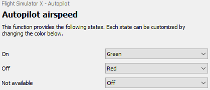

Scripting
=========

All functionality introduced by G940LEDControl is described in the :doc:`scriptingreference`. For more information about Lua in general, please refer to the `Lua 5.2 Reference Manual <https://www.lua.org/manual/5.2/>`_.

This guide will walk through how Lua scripting works in G940LEDControl. To avoid confusion when talking about functions in this context they will be referred to as 'button functions' and 'Lua functions'.

Script locations
----------------
The default scripts included with G940LEDControl can be found in the folder selected during installation, for example "C:\\Program Files (x86)\\G940 LED Control". In there you will find a Scripts\\FSX folder containing the Lua files.

In addition scripts are loaded from your user data path. This folder is automatically created by G940LEDControl after you have changed any button configuration or settings. To open the folder, type or paste "%APPDATA%\\G940LEDControl" into a Windows Explorer address bar and press Enter. Inside you can create the same Scripts\\FSX folder structure. Scripts in this folder will not be overwritten when installing a new version.

Anatomy of a button function
----------------------------
Let's take the Autopilot airspeed button function as an example, which at the time of writing looks like this:

::

  local strings = require './lib/strings'

  RegisterFunction(
    {
      uid = 'autoPilotAirspeed',
      category = strings.Category.FSX.AutoPilot,
      displayName = 'Autopilot airspeed',
      states = {
        on = { displayName = 'On', default = LEDColor.Green },
        off = { displayName = 'Off', default =  LEDColor.Red },
        notAvailable = { displayName = 'Not available', default = LEDColor.Off }
      }
    },
    function(context)
      SetState(context, 'notAvailable')

      OnSimConnect(context,
        {
          autoPilotAvailable = { variable = 'AUTOPILOT AVAILABLE', type = SimConnectDataType.Bool },
          autoPilotAirspeed = { variable = 'AUTOPILOT AIRSPEED HOLD', type = SimConnectDataType.Bool }
        },
        function(context, data)
          if data.autoPilotAvailable then
            if data.autoPilotAirspeed then
              SetState(context, 'on')
            else
              SetState(context, 'off')
            end
          else
            SetState(context, 'notAvailable')
          end
        end)
    end
  )

Using anonymous functions like this to implement the various callbacks results in compact code, which can arguably be more difficult to read. For clarity let's expand it first. The following example works exactly the same:

::

  local strings = require './lib/strings'

  local function variablesChanged(context, data)
    if data.autoPilotAvailable then
      if data.autoPilotAirspeed then
        SetState(context, 'on')
      else
        SetState(context, 'off')
      end
    else
      SetState(context, 'notAvailable')
    end
  end

  local function setup(context)
    SetState(context, 'notAvailable')

    OnSimConnect(context,
      {
        autoPilotAvailable = { variable = 'AUTOPILOT AVAILABLE', type = SimConnectDataType.Bool },
        autoPilotAirspeed = { variable = 'AUTOPILOT AIRSPEED HOLD', type = SimConnectDataType.Bool }
      },
      variablesChanged)
  end

  RegisterFunction(
    {
      uid = 'autoPilotAirspeed',
      category = strings.Category.FSX.AutoPilot,
      displayName = 'Autopilot airspeed',
      states = {
        on = { displayName = 'On', default = LEDColor.Green },
        off = { displayName = 'Off', default =  LEDColor.Red },
        notAvailable = { displayName = 'Not available', default = LEDColor.Off }
      }
    },
    setup)

So what's happening? When the script is loaded it is automatically run. At this time you should call :ref:`ref-registerfunction` for each button function you want to be visible in G940LEDControl. :ref:`ref-registerfunction` accepts two parameters: a table which describes the button function you want to add, and a Lua function to be called when the button function is assigned to a button.

Every button function must have a unique 'uid'. It is used to save and load profiles and should therefore not be changed once in use. The category and displayName are only used in the main and button function selection screens and can be freely changed.

A button function must also have one or more states. Each state has a key which, like the 'uid', is used to save and load profiles and should also not be changed once in use. A default :ref:`LED color <ref-ledcolor>` can also be set, which sets the initial value in the selection screen when assigning it to a button:

Setup function
~~~~~~~~~~~~~~

As soon as the button function is attached to one of the buttons the setup function passed to :ref:`ref-registerfunction` is called. It receives a 'context' parameter, the contents of which are not useable by the script directly, but which you need to pass along to for example :ref:`ref-setstate` later on so that it knows which button function's state needs to be changed.

In the above example the first thing we do is to set the default state using :ref:`ref-setstate`. The second parameter is a string containing the key of one of the states as defined in the :ref:`ref-registerfunction` call.

After that you will normally call one of the built-in Lua functions to be notified of certain events. At the time of writing you can either call :ref:`ref-ontimer` to perform checks on a regular interval or, more common in the case of FSX, :ref:`ref-onsimconnect` to be notified when one or more of the `simulation variables <https://msdn.microsoft.com/en-us/library/cc526981.aspx>`_ change.